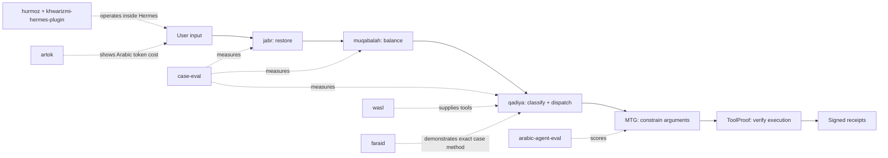

# Mizan ميزان

**The reliability scale for AI agents.**

Restore the prompt, balance contradictions, classify the case, constrain the arguments, verify the execution, then weigh the evidence.

Mizan is built Arabic-first because Arabic exposes failures English often hides: morphology, dialect drift, transliteration, right-to-left text, BiDi safety, and token cost. What survives Arabic survives anything.

This repository is the spine for the Mizan stack. It does not replace the existing repos. It makes them read as one system.

## Thesis

Agents need a scale before autonomy. Every prompt transformation should be restorable, every contradiction should be balanced or escalated, every tool argument should be constrained, and every execution should leave a receipt that can be weighed against what the agent claims.

## Use

```python
from mizan import preflight, PreflightContext

r = preflight(
    "send it. cancel it.",
    PreflightContext(contradiction_predicates=[("send", "cancel")]),
)
r.ok            # False — contradiction is fail-loud, not silently resolved
r.contradiction # the conflict, surfaced for a clarifying question
r.receipt.to_dict()  # the weighable trail (restore + balance stages)
```

Constraint-driven tool gating (the `qadiya` step):

```python
from mizan import ToolGate, equals_constraint

gate = ToolGate(
    [equals_constraint("tool", "tool_name", ["read_file", "search"])],
    allowed_case_ids=["tool=read_file", "tool=search"],
)
gate.check({"tool_name": "rm_rf", "args": {}}).allowed  # False — escalated, never silently run
```

The three primitives (`jabr`, `muqabalah`, `qadiya`) are not yet on PyPI. In a dev tree, `mizan` adds local checkouts under `~/Projects` to `sys.path`; to install, run `pip install -e ../jabr -e ../muqabalah -e ../qadiya -e .`.

## Stack



## Repo Map

| Stage | Repo | Verb | Current state | Next improvement |
|---|---|---|---|---|
| Pre-LLM input integrity | [jabr](https://github.com/Moshe-ship/jabr) | restore | Reversible prompt-context restoration, 31 tests | Publish as part of one preflight package |
| Pre-LLM input integrity | [muqabalah](https://github.com/Moshe-ship/muqabalah) | balance | Reversible cancellation and fail-loud contradiction handling, 19 tests | Share a common receipt format with the rest of the stack |
| Pre-LLM input integrity | [qadiya](https://github.com/Moshe-ship/qadiya) | classify + dispatch | Constraint-driven case registry, 15 tests | Done — exposed as `mizan.ToolGate` and wired into the Hermes plugin |
| Proof it works | [case-eval](https://github.com/Moshe-ship/case-eval) | measure | 272 ambiguous prompts, deterministic and LLM-in-the-loop modes, 28 tests | Keep results reproducible and publish the key tables from fresh runs |
| During tool selection | [mtg](https://github.com/Moshe-ship/mtg) | constrain | Morphological Type Guards for multilingual tool arguments, v0.1 advisory mode | Move from advisory diagnostics toward enforceable policy modes |
| Post execution | [toolproof](https://github.com/Moshe-ship/toolproof) | verify | Pre-execution gating, signed receipts, 95 tests, v0.5.0 | Publish the adversarial dataset and methodology behind headline claims |
| Benchmark | [arabic-agent-eval](https://github.com/Moshe-ship/arabic-agent-eval) | score | 51 Arabic function-calling items, 6 categories, 5 dialect variants, 22 functions | Reframe as open/installable/dialect-split, publish HF dataset and leaderboard |
| Tool layer | [wasl](https://github.com/Moshe-ship/wasl) | connect | Arabic MCP server, 30 tools | Register and demo as the Arabic tool substrate for agents |
| Agent runtime | [hurmoz](https://github.com/Moshe-ship/hurmoz) | operate | 63 Arabic Hermes skills | Keep as the Arabic skills layer and link the reliability stack from relevant skills |
| Agent runtime | [khwarizmi-hermes-plugin](https://github.com/Moshe-ship/khwarizmi-hermes-plugin) | operate | Thin Hermes adapter over `mizan`: preflight + qadiya tool gate (all four ops) | Rename to `mizan-hermes-plugin` when stable |
| Funnel | [artok](https://github.com/Moshe-ship/artok) | reveal | Arabic Token Tax calculator across 18 tokenizers | Publish as a Hugging Face Space and use it as top-of-funnel |
| Method showcase | [faraid](https://github.com/Moshe-ship/faraid) | demonstrate | Working inheritance calculator plus al-Khwarizmi six-case algebra, 16 tests | Use as a precise public example of the case method |

## Pipeline

```text
input
  -> restore missing context                 jabr
  -> balance duplication and contradictions  muqabalah
  -> classify into explicit cases            qadiya
  -> dispatch registered procedure           qadiya
  -> constrain multilingual tool arguments   mtg
  -> gate, execute, verify, and sign         toolproof
  -> score and publish evidence              case-eval + arabic-agent-eval
```

## Why It Is Called Mizan

A *mizan* is a scale: it brings two sides into balance and it measures. Both meanings are the point.

The operations that bring an agent's input into balance are the same operations that gave algebra its name. Al-Khwarizmi's book titled them `al-jabr` (restoration) and `al-muqabalah` (balancing):

- `jabr` restores missing terms instead of letting a model silently guess.
- `muqabalah` balances duplicates and contradictions instead of letting a model silently choose.
- `qadiya` turns the remaining request into explicit cases instead of vague intent routing.
- `mtg` gives multilingual tool arguments stronger types than plain strings.
- `toolproof` records what actually ran, then verifies claims against signed receipts.

Mizan is the scale those operations serve. The brand is useful only if the engineering stays literal: a scale for agents means explicit operations, complete cases, reversible transformations, and auditable, weighable outcomes.

## Honest Boundaries

- This repo now ships a small `mizan` package (the unified `preflight` and `ToolGate`); the underlying primitives still live in their own repos.
- The Hermes plugin now runs all four operations: `jabr` + `muqabalah` via `mizan.preflight`, and `qadiya` via `mizan.ToolGate`. The tool gate is a tool-name allowlist today; richer constraints (arg scope, target sensitivity) are supported by `ToolGate` but not yet surfaced in config.
- MTG is advisory in v0.1.0. It logs violations but does not block calls.
- ToolProof's strongest headline claims need a published dataset and reproducible methodology before they should be used in investor/customer copy.
- `arabic-agent-eval`, `wasl`, and `hurmoz` should avoid "first" or "largest" claims unless those claims are actively re-verified. Safer framing: open, installable, Arabic-first, dialect-aware.

## Classification Rule

Every repo should have one job:

| Class | Rule | Examples |
|---|---|---|
| Core | Part of the reliability pipeline | `jabr`, `muqabalah`, `qadiya`, `case-eval`, `mtg`, `toolproof`, `arabic-agent-eval`, `wasl`, `hurmoz`, `khwarizmi-hermes-plugin`, `artok` |
| Proof | Shows credibility or a worked method | `faraid`, `Tarminal`, `Lisan`, `bidi-guard` |
| Suite | Belongs under an Arabic AI developer toolkit umbrella | `samt`, `mukhtasar`, `sarih`, `safha`, `qalam`, `raqeeb`, `naql`, `majal`, `jadwal`, `khalas` |
| Port | Valuable but on the older runtime surface | `mkhlab` into Hermes/Hurmoz |
| Client/cash | Funds the work and tests it in production | `performancemax`, `localbiz`, `yalla-ads`, `pmax-core` |
| Archive | One-off with no role, no proof value, and no cash value | Decide after audit, not blindly |

## Next Moves

1. Finish the preflight: wire `qadiya` into the Hermes plugin so all four operations run.
2. Publish the measurement layer: `arabic-agent-eval` as a Hugging Face dataset and leaderboard Space, with `case-eval` results linked.
3. Chain receipts: make `jabr`, `muqabalah`, `qadiya`, `mtg`, and `toolproof` produce a compatible audit trail.
4. Distribute: submit `hurmoz`, the Hermes plugin, and `wasl` to the relevant Hermes/MCP discovery surfaces.
5. Clean up repo positioning: update downstream READMEs to use the same verbs, avoid stale "first" claims, and link back here.

## One-Line Pitch

**Mizan is an Arabic-first reliability scale for AI agents: restore the prompt, balance contradictions, classify the case, constrain the arguments, verify the execution, and weigh the evidence.**
